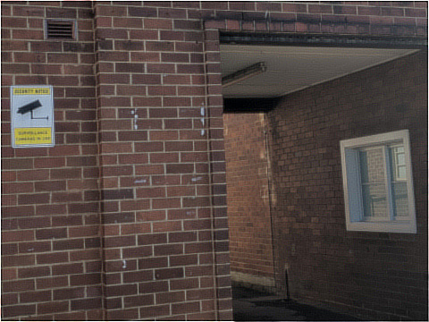

# convolver

Unblurs images. Maybe.

```shell
./conv.py data/blur1.2.jpg data/k1.2.npy
```

This will display:



Starting from the input image `data/blur1.2.jpg`:


And convolving it with the deblur kernel:


`conv.py` calculates `output_img`.

`kern.py` calculates `kernel`.

## Introduction

My hope is that these tools are easy enough to install and operate, so that they
can be used by people who don't necessarily have a Python background, to process
images to improve them or just for fun.

Convolver has two main components:

`conv.py` convolves an image with a kernel.
Depending on the choice of kernel, this can be a blur, an unblur(!),
an edge detector, etc.

`kern.py` finds the convolution kernel that converts one image into another.

Given a blurry and a sharp version of the same image, `kern.py` will try to find
either the Point Spread Function of the blur, or (depending on argument order)
the inverse of the Point Spread Function which unblurs the image.
It does this using gradient descent.

## Installing this software

Optionally, set up a virtualenv:

```shell
apt install virtualenv
virtualenv -p python3 my_env
source my_env/bin/activate
```

Install dependencies:

```shell
apt install python3 python3-pip python3-dev build-essential libcairo2-dev
pip3 install tensorflow pillow pycairo pygame
```

Install convolver:

```shell
git clone https://github.com/emikulic/convolver.git
cd convolver
```

Run the test like at the top of this page:

```shell
./conv.py data/blur1.2.jpg data/k1.2.npy
```

## User's Guide

### conv.py

This convolves an image with a kernel and displays the result.
Hit ESC to close the viewer window.
Example:

```shell
./conv.py input.jpg kernel.npy
```

To save to a file instead of viewing the output:

```shell
./conv.py input.jpg kernel.npy -out output.png
```

By default, no gamma correction is applied.
If your image has gamma 2.2 and you want to correct for it:

```shell
./conv.py input.jpg kernel.npy -gamma 2.2
```

### kern.py

This finds a convolution kernel given two images, using gradient descent.
Example:

```shell
./kern.py blurry.jpg sharp.jpg kernel-1
```

The above will try to find a kernel such that:

`tf.nn.conv2d(blurry, kernel) == sharp`

i.e. It will find a kernel that unblurs `blurry.jpg` so that it looks like
`sharp.jpg`.

You could also pass the inputs in reverse and recover the blur kernel, but
that's not as fun.

The above command will display an image of the current progress, and
produce a directory `kernel-1/` which contains snapshots of the kernel (as
`.npy` files) and snapshots of the displayed image.

The directory can be fed into `conv.py` as a kernel.

The optimizer can be stopped by hitting ESC (or using the `-max_steps` argument
as documented below).

Running `kern.py` with an existing kernel directory will resume optimizing it.

The `kern.py` script has a lot of commandline arguments to tune the process:

* `-n` sets the size of the kernel.
You probably want this to be an odd number.
Larger kernels are slower and cause more artifacts at the edge of the output,
but are otherwise more accurate.

* `-sym False` will produce a non-symmetric kernel.
If the blur was symmetric, then you can use a symmetric deblur kernel, which
is the default.

* `-gamma` can be used to set the input image's gamma.
By default, there's no gamma correction.

* `-reg_cost` is used to regularize the kernel, i.e. put pressure on the
optimizer to minimize the values in the kernel.

* `-learn_rate` is the learning rate for the optimizer.
If the optimizer is not converging, change the learning rate.
If that doesn't work, change the learning rate more.

* `-max_steps` - exit after this many steps. The default is to run forever.
This option is useful if you're doing a parameter sweep and you want to
e.g. make a shell script that trains ten kernels with different settings with a
thousand steps each.

* `-num_steps` - log progress after this many steps of the optimizer.

* `-crop_{x,y,w,h}` - when optimizing, only consider the window starting
at (x,y) with size (w,h).
By default, the entire input image is used.

* `-fps` - how many times per second to update the progress image.
Set to zero to disable the viewer and run headless.

## Utilities - User's Guide

### cost.py

Can be used to assess multiple kernels over the same image pair.
Takes arguments in the same order as `kern.py`.
Example:

```shell
./cost.py blurry.jpg sharp.jpg kernel-*
```

### plot.sh

Uses gnuplot to plot the loss against
the step number, based on a kernel's `log.txt` file.
Example:

```shell
./plot.sh kernel-1 kernel-2
```

### resize.py

Resizes a kernel, either to shrink (crop) it, or to expand it, in which case the
new pixels are randomized.
In either direction, it's a good idea to resume training the resized kernel
in order to minimize error.
Example:

```shell
# Train small kernel.
./kern.py blurry.jpg sharp.jpg -n 7 kernel-1

# Expand it.
./resize.py kernel-1 kernel-2 11

# Train the bigger kernel.
./kern.py blurry.jpg sharp.jpg kernel-2

# Compare results.
./cost.py blurry.jpg sharp.jpg kernel-*
```

### view.py

Displays one or more kernels.
Zero is black, negative values are blue.
Example:

```shell
./view.py kernel-1
```

To write to a file instead of displaying:

```shell
./view.py kernel-* -out kernels.png
```
